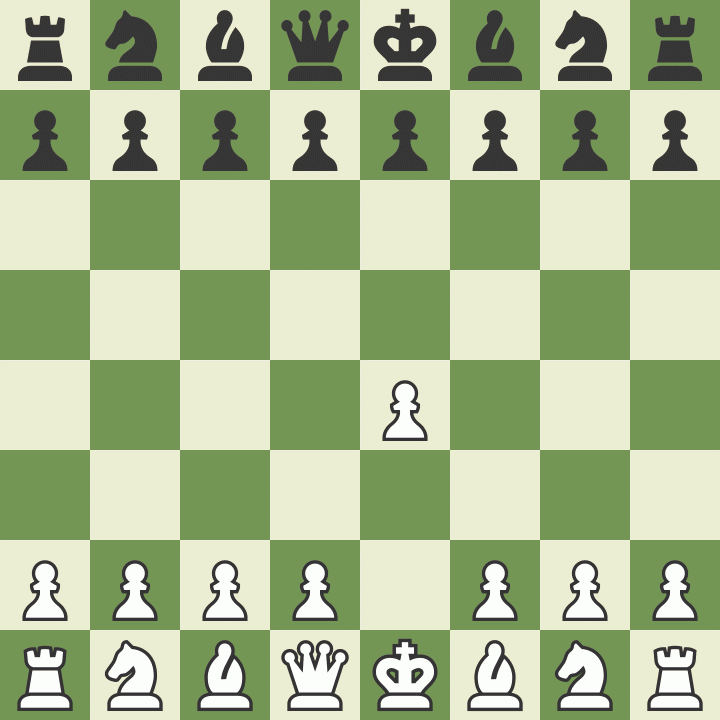

# Installation
```bash
pip install -r requirements.txt
pip install cairosvg
```

If you run into installation issues with cairosvg and avoit issues run
```bash
conda install cairo pango gdk-pixbuf libffi cairosvg
```

# ChessVision
The purpose of this project is to parse a complete chess game from a video.
To tackle this problem I addressed the simpler issue of chess position recognition by exploiting a pre-trained model by Georg Wölflein et al. and fine tuning.

The repo suggests taking a picture of the starting position from both sides. I deemed the results to be unsatisfactory, thus repeating the process with a larger pool of images. To ease the process of obtaining labels (FENs) for positions, I took pictures of chess games and parse the FEN directly from the PGN.

The dataset will be made publicly available, it consists of pictures taken from both perspectives (white and black) move-by-move of famous chess games, including:
* Morphy's Opera Game
* Alekhine - Nimzowitsch (1930)
* Tal - Hjartarson 1987


# Inference
The inference process is still faulty, but the occupancy classifier mostly detects all pieces and rarely includes false negatives. This means that illogical board states can be parsed out.
This implementation can filter out the following:
* Piece moving from one square to another, but on the second board state it is misclassified.
* Pawns appearing on the first or last rank are filtered out.
* Pieces appearing on squares that are unreachable via legal moves are removed.



# Installation
```bash
pip install -r requirements.txt
pip install cairosvg
```

If you run into installation issues with cairosvg and avoit issues run
```bash
conda install cairo pango gdk-pixbuf libffi cairosvg
```

[def]: source/opera_game.gif