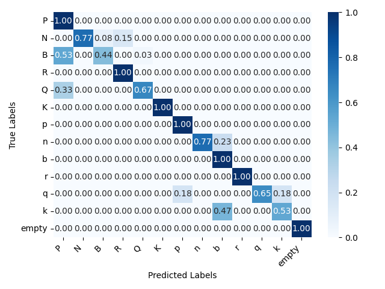
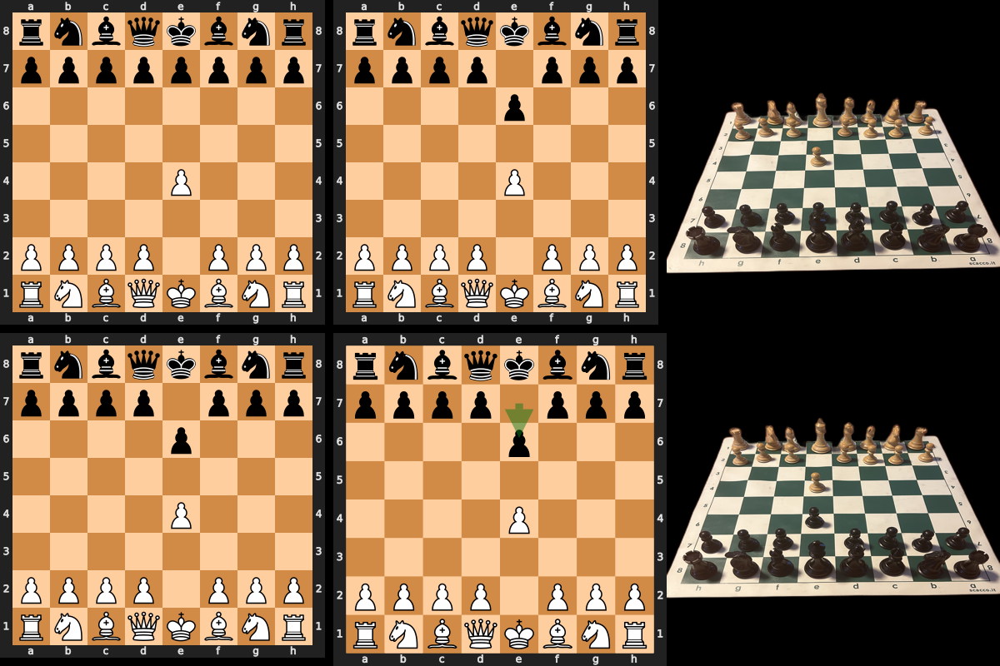
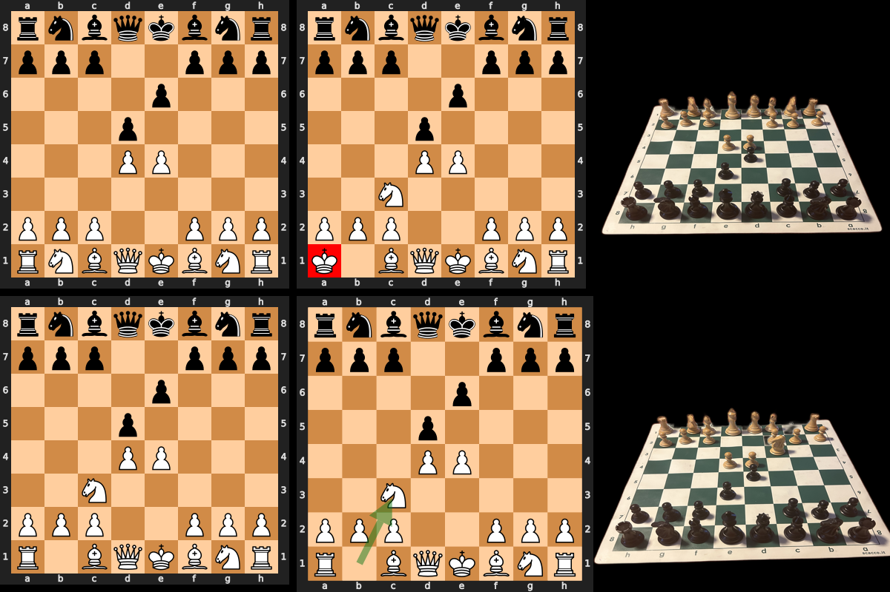
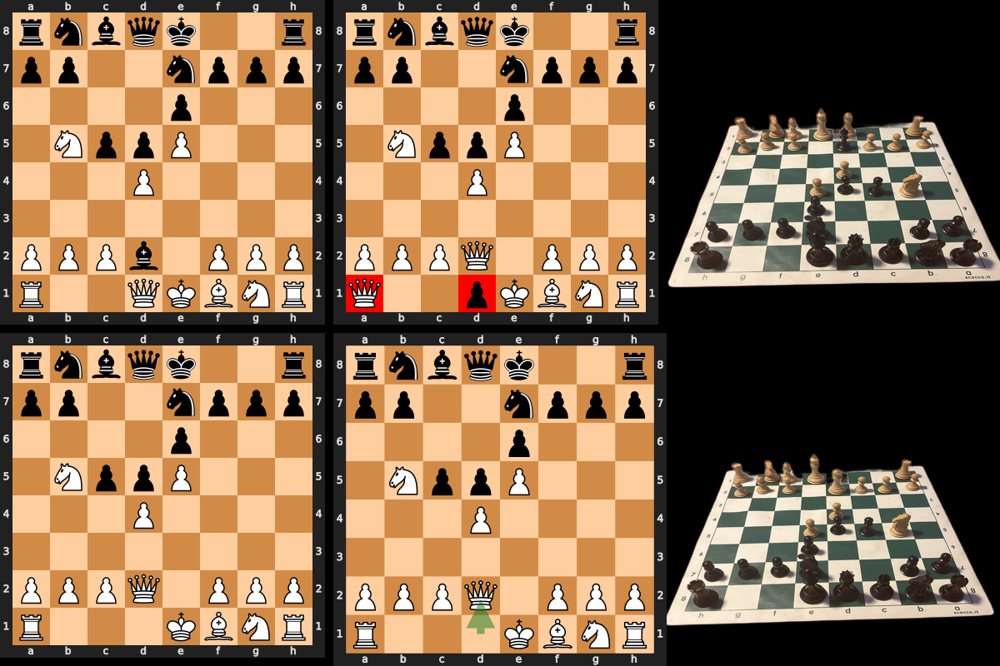
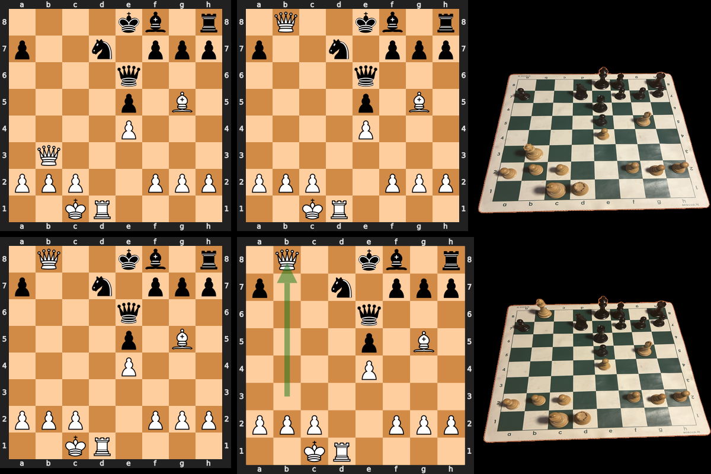
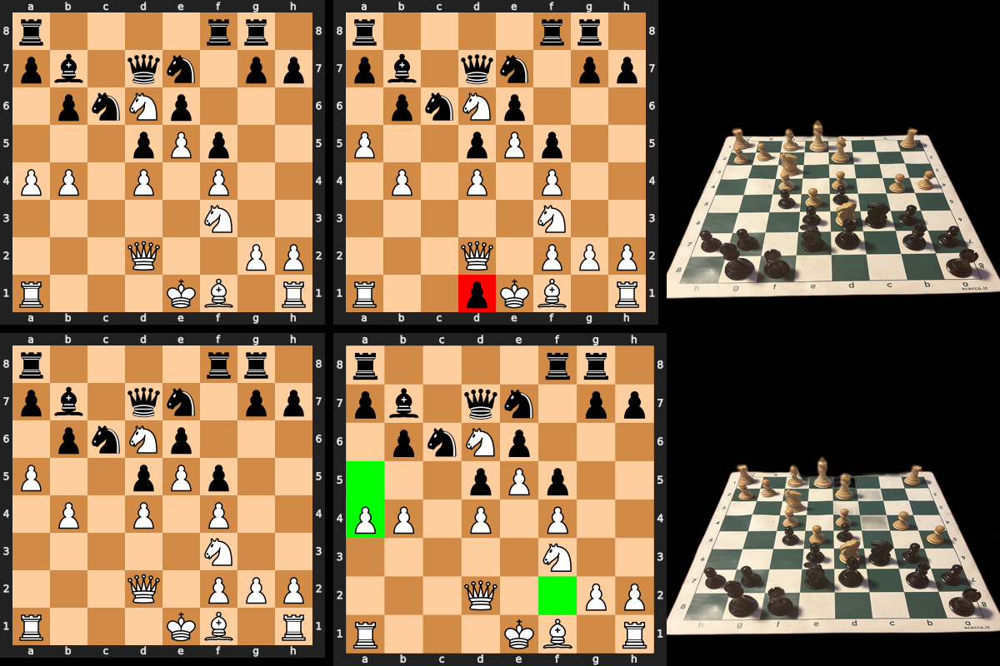
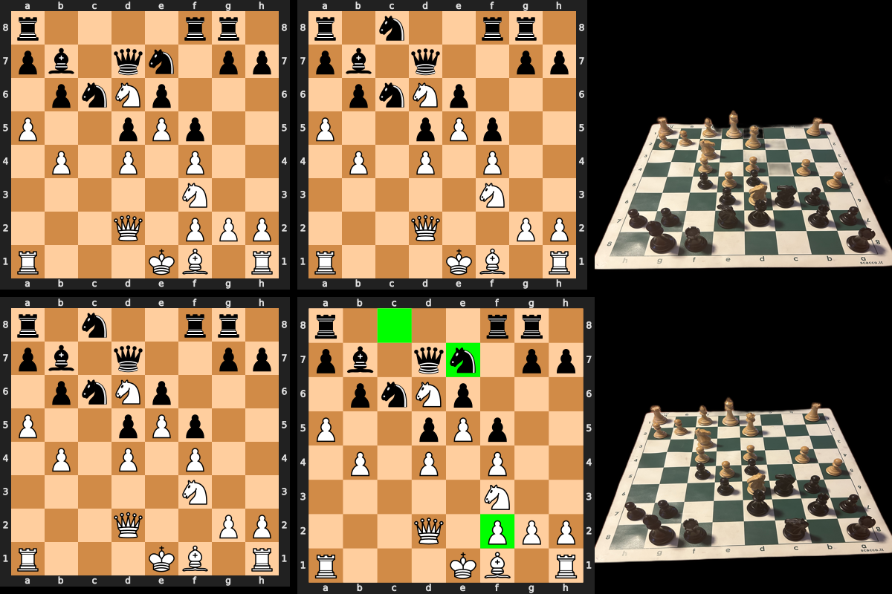

# ChessVision
<div align="center">
  <h1 style="border-bottom: none;">Computer Vision project: 3D CAMERA CALIBRATION (geometry and 3D reconstruction)</h1>
  
  
  
  
  
</div>
1. [Overview](#Overview)
2. [Installation](#Installation)
3. [Usage](#Usage)
4. [Evaluation](#Evaluation)


This project combines the efforts of [chesscog](https://github.com/georg-wolflein/chesscog) by Georg Wölflein and some of my own work which consists of fine-tuning the model, creting a small dataset and adding some chess game logic to remove inconsistencies in the board state.

This work is still in progress. The final objectives is to parse the full game from video, but the current state of the project is to parse a game from a sequence of images taken by a user. A whole pipeline to select the video frames and process them in real time is still to be implemented.
<div style='width=100%;display:flex;align-items:center;'> 
<div style='margin:auto;width:30%;'>
    <h3>Morphy's Opera Game</h3>
    
</div>
</div>

# Overview
The model consists of a pretrained occupancy classifier (ResNet) and piece classifier (InceptionV3). The model was trained by the authors of chesscog on a dataset of ~5,000 synthetically generated images (3D renderings of chess positions from different angles and with varying light).
After investigating the limits of this approach I shot pictures of 3 chess games, from both player perspectives, move-by-move. The dataset consists of 358 images, 179 for each perspective. 
Some additional images were taken to test the model on a different chess boards and chess sets than the one used in the training set.

Please note that the system's main weakness is the RANSAC board localisation. To address the issue of too many lines being in the image I leveraged background removal by [rembg](https://github.com/danielgatis/rembg). If the system fails try taking better shots of the image by changing the angle. Having a clean and realiable background leads to faster inference.


## ChessVision
The purpose of this project is to parse a complete chess game from a video.
To tackle this problem I addressed the simpler issue of chess position recognition by exploiting a pre-trained model by Georg Wölflein et al. and fine tuning.

The repo suggests taking a picture of the starting position from both sides. I deemed the results to be unsatisfactory, thus repeating the process with a larger pool of images. To ease the process of obtaining labels (FENs) for positions, I took pictures of chess games and parse the FEN directly from the PGN.

The dataset will be made publicly available, it consists of pictures taken from both perspectives (white and black) move-by-move of famous chess games, including:
* Morphy's Opera Game
* Alekhine - Nimzowitsch (1930)
* Tal - Hjartarson 1987

# Installation
To run the project I suggest using python 3.8.
```bash
conda create -n chessvision python=3.8
conda activate chessvision
pip install -r requirements.txt
pip install cairosvg
```

If you run into installation issues with cairosvg and avoit issues run
```bash
conda install cairo pango gdk-pixbuf libffi cairosvg
```


# Usage
For sheer training, evaluating and testing or corner detection the model please refer to the [chesscog](https://github.com/georg-wolflein/chesscog) repository. 
After populating the train partition of the dataset (data://transfer_learning/train) with images run the following:
```bash
python -m chesscog.transfer_learning.create_dataset
python -m chesscog.transfer_learning.train
python -m chesscog.transfer_learning.evaluate 
# this will return some basic statistics for the model
python stats.py
# this will generate a confusion matrix in results/
```

If you find the results to be satisfactory, copy the model from runs/ to models://transfer_learning/ and run the main script. This will work on a sequence of images, run main.py with the path to the folder containing the images as an argument.
```bash
python main.py path/to/folder
```

# Future Work
The project is still in progress. The following steps are to be implemented:

## Evaluation
An automatic evaluation and benchmarking process is yet to be implemented.

## Parsing from video
The final goal of this project is to parse a chess game from a video. This work is still in progress and yet to be devoloped.

## Testing and Evaluation
The ability of the model to generalise is to be better tested. I plan to test the model by training it on different chess boards and chess sets and test how many shots of the game chessboard are needed to parse the game successfully. i.e. If the game is played on a green-and-white board, how many shots of the board are needed to parse occupancy reliably.
The same kind of experiment is to be repeated on different chess sets.

# Inference Results
The inference process is still faulty, but the occupancy classifier mostly detects all pieces and rarely includes false negatives. This means that illogical board states can be parsed out.



As the confusion matrix shows, the piece classifier mostly has trouble discriminating between queens, bishops and pawns. This is due to their similarity from a top-view perspective. Also, the model has more trouble classifying the black pieces as they too matte.


This implementation can filter out the following:
* Piece moving from one square to another, but on the second board state it is misclassified.
* Pawns appearing on the first or last rank are filtered out.
* Pieces appearing on squares that are unreachable via legal moves are removed.

<ul style='display:grid; grid-template-columns: 1fr 1fr; grid-template-rows: 1fr 1fr;list-style:none;'>
    <li style='margin: 2px;'>Sample initial position</li>
    <li style='margin: 2px;'>Example of misclassified piece corrected with logic</li>
    <li style='margin: 2px;'>Chess move recognised despite two mistakes by the classifier</li>
    <li style='margin: 2px;'>A beautiful checkmating sacrifice</li>
    <li style='margin: 2px;'>The disappearing and reappearing f2-pawn</li>
    <li style='margin: 2px;'>Same issue</li>
</ul>
